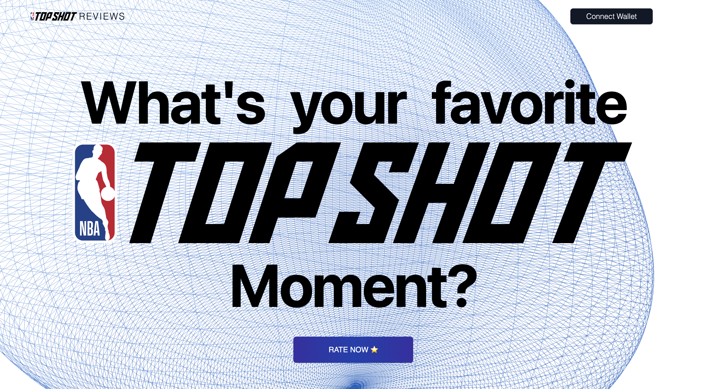
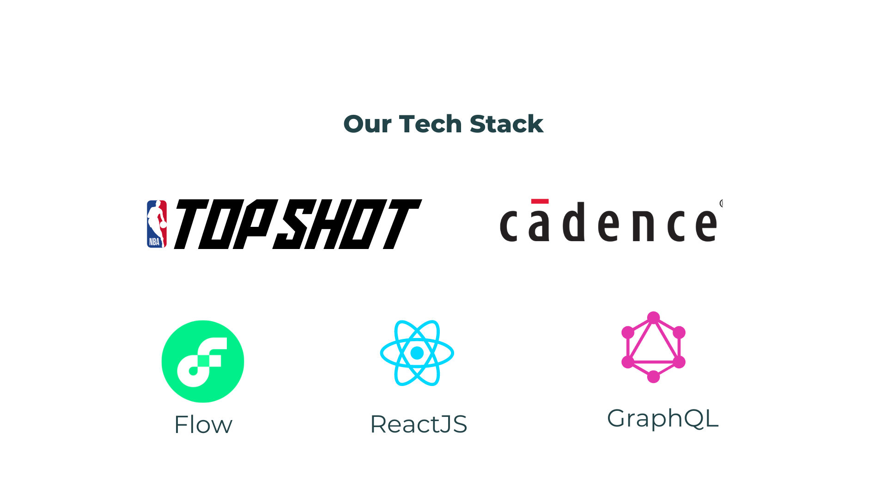

## NBA TOPSHOT Reviews

### What's you favorite moment?

<br>

NBA Topshot Reviews is a DAPP built on flow chain using NBA TopShot. It allows users to add reviews for a particular moment. It also allows users to get all the reviews for a particular moment.
<br>
<br>

### Landing Page

<br>



<br>

## Steps to Run the Project

<br>

1. Clone the repo

```
git clone https://github.com/Novobloc/nba-topshot-reviews
```

2. Install the dependencies.

```
 npm i
```

3. Start the app using command

```
npm start
```

4. Open this link in browser http://localhost:3000

5. Hey, You just ran the code in your system, thats it. Now you can rate your favorite Topshot moment .

<br>
<br>

## Stack We Used

<br>


<br>

1. Frontend: We used **React JS**, Tailwind CSS and 3js for UI.

2. Blockchain :
   1. Onflow SDK: We used **@onflow/fcl** SDK for social login and wallet.
   2. Cadence: We used **Cadence** language to write scripts and transactions in order to interact with Flow chain.
   3. GraphQL: We used **GraphQL** to query nba topshot and to retrieve data in real time.
   4. Chain: We used **Flow** blockchain testnet to store review data.
   5. Dapper Studios: We built our app using **NBA Topshot** from Dapper Studios.
   6. Deployment: We created a contract and deployed it on Flow Block Chain testnet from Flow CLI. (You can find the command we used below)

<br>
<br>

## Demo

<br>

Github : <a style="margin-bottom: 5px;" href="https://github.com/Novobloc/nba-topshot-reviews" target="_blank"> Repo Link </a>

Video : <a style="margin-bottom: 5px;" href="" target="_blank"> Youtube Link </a>

PPT: <a style="margin-bottom: 5px;" href="https://nba-topshot-reviews.netlify.app/project-ppt.pdf" target="_blank"> Document Link </a>

<br>

## Meet Our Team

<div style="display: flex; justify-content: space-between; align-items: center;">
   <p style="flex:1">Shiva Kumar: </p>
   <div style="flex:4; justify-content: space-between;">
      <a href="https://www.linkedin.com/in/shivamangina/" target="_blank">
      
      </a>
      <a href="https://twitter.com/shivakmangina" target="_blank">
      
      </a>
      <a href="https://www.instagram.com/shiva_mangina" target="_blank">
      
      </a>
      <a href="https://github.com/shivamangina" target="_blank">
      
      </a>
   </div>
</div>

<div style="display: flex; justify-content: space-between; align-items: center;">
   <p style="flex:1">Sandeep Kumar: </p>
   <div style="flex:4; justify-content: space-between;">
      <a href="https://www.linkedin.com/in/satyasandeep" target="_blank">
      
      </a>
      <a href="https://twitter.com/satyasandeep76" target="_blank">
      
      </a>
      <a href="https://www.instagram.com/satyasandeep007" target="_blank">
      
      </a>
      <a href="https://github.com/satyasandeep007" target="_blank">
      
      </a>
   </div>
</div>

<br />

## Flow Commands:

### Account

```
0xb880e7b2e2c0a70b
```

### Check status

```
flow status -n testnet
```

To deploy the contract, run the following commands:

```
flow project deploy --network=testnet
```

At the end of the deployment, you should see the following output:

```
ReviewContract -> 0xb880e7b2e2c0a70b (daf12b7c1f67897398ded3c0faf86cd980eb321f8bda27a163bf892970dbc9d7)
```

To run the tests, run the following command:

```
flow scripts execute cadence/scripts/getAllReviews.cdc --network=testnet
```

To add a review, run the following command:

```

flow transactions send cadence/transactions/addReview.cdc 4 "One of the best moments" "Mon Feb 27 2023 00:57:57 GMT+0530 (India Standard Time)" "123" --network=testnet
```
